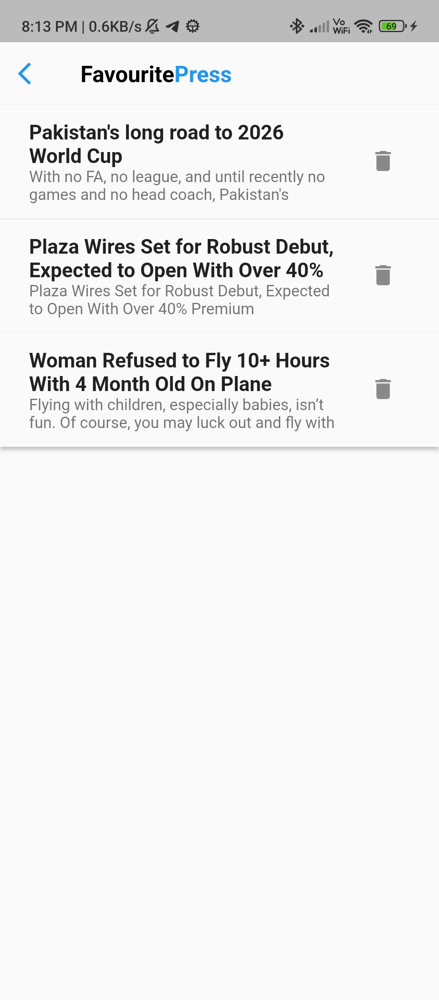
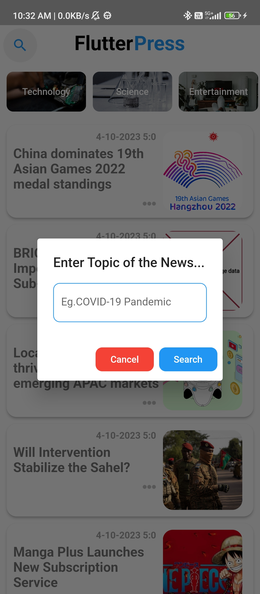
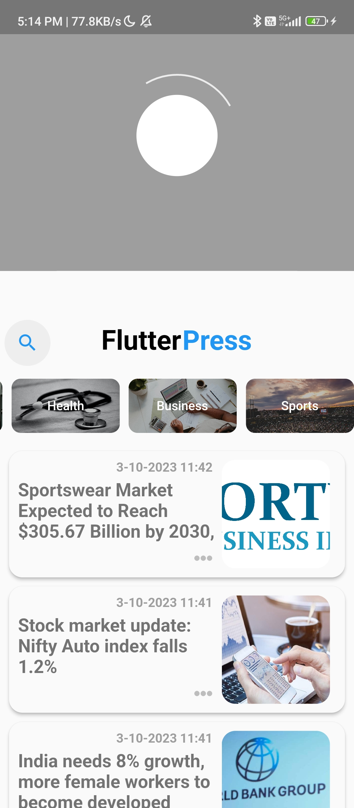

# Flutter News App Using 'newsapi.org' API
A Flutter-based news app that allows users to read the latest news articles from various sources and categories. Data is fetched from the News API, and the app includes a landing page that is displayed only once using `shared_preferences`.


## Features

- Browse the latest news articles from various sources.
- Landing page displayed only once using `shared_preferences`.
- Browse news articles by category.
- Save news articles to read later using `Hive DB`.
- Clean and intuitive user interface.
- Search for news articles.
- Read news articles in a web view.
- Pull to refresh news articles.


# Screenshots
<div height = "500">







</div>

### Installation

   ```bashtodays match timing
   git clone https://github.com/shutterscripter/FlutterPress
   
   cd FlutterPress

   flutter run 
