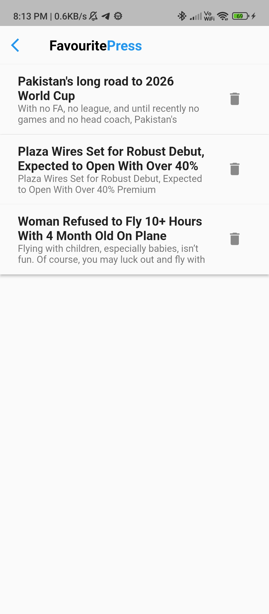
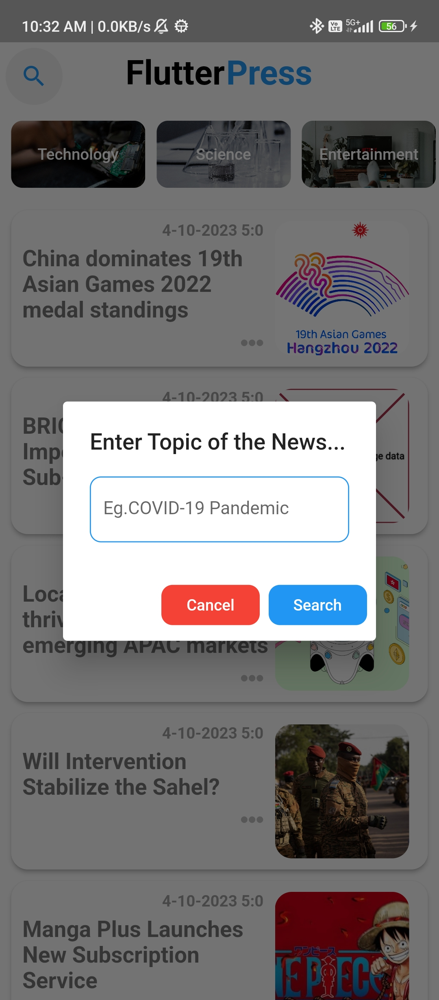
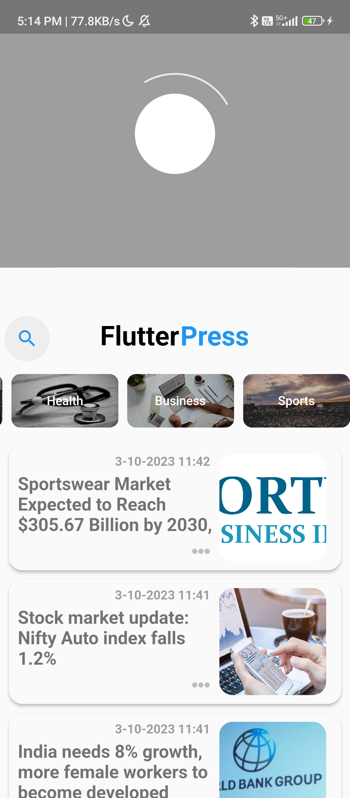

# FlutterPress

A premium, modern Flutter-based news application that delivers the latest headlines with a stunning UI and powerful features. Powered by **NewsAPI** for content and **Supabase** for secure authentication.

## ✨ Features

- **Authentication**: Secure Signup and Login using Supabase Auth.
- **AI Summarization**: Get concise summaries of news articles instantly using on-device ML.
- **Modern UI/UX**: 
  - Glassmorphic design elements.
  - Smooth staggered animations.
  - Premium aesthetic with dark/light mode support.
- **Smart Bookmarking**: Save your favorite stories locally using Hive DB.
- **Category Browsing**: Explore news by categories (Tech, Business, Sports, etc.).
- **WebView Integration**: Read full articles seamlessly within the app.
- **Article Management**: Swipe to remove bookmarks, easy sharing options.

## 📱 Screenshots

<div align="center">
  
  
  
  
</div>
<div align="center">
  
  
  
</div>

## 🎥 Demo

Check out the app in action:

https://github.com/user-attachments/assets/lutter-press.mov

*(Video located at `assets/lutter-press.mov`)*

## 🛠️ Tech Stack

- **Framework**: Flutter
- **Language**: Dart
- **State Management**: GetX
- **Authentication**: Supabase
- **Local Storage**: Hive
- **Networking**: HTTP, NewsAPI
- **UI/Animations**: Flutter Staggered Animations, Glassmorphism, Iconsax

## 🚀 Installation

1. **Clone the repository**
   ```bash
   git clone https://github.com/shutterscripter/FlutterPress.git
   cd FlutterPress/frontend
   ```

2. **Install Dependencies**
   ```bash
   flutter pub get
   ```

3. **Run the App**
   ```bash
   flutter run
   ```

## 🔮 Future Roadmap

- [ ] Enhanced Search capabilities
- [ ] Personalized News Feed
- [ ] Push Notifications
- [ ] Offline Reading Mode


